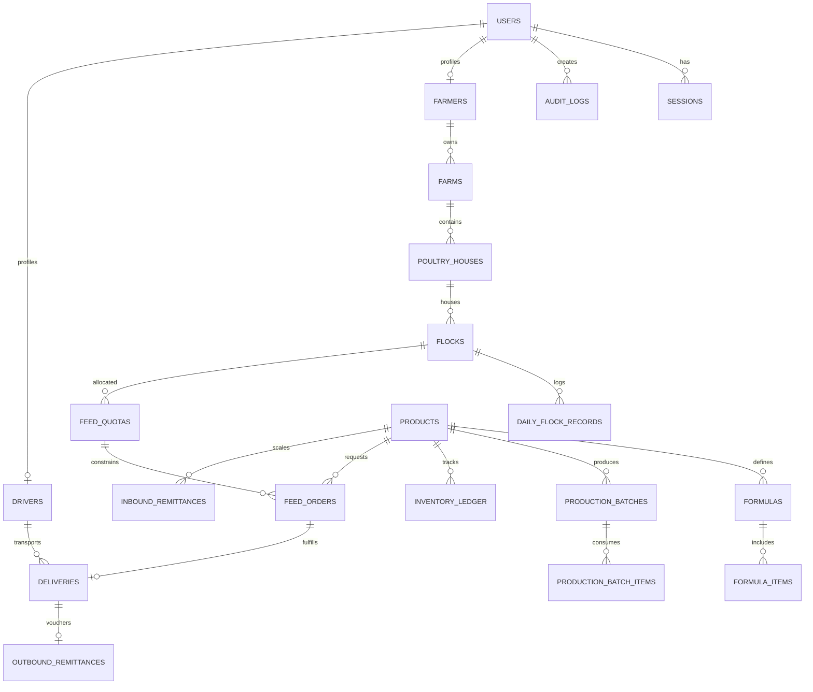

# NIRWARE NEXT — Database Specification

## 1. Overview & DBMS Requirements

NIRWARE NEXT requires a production-grade **PostgreSQL 18** installation. Embedded or in-memory engines (SQLite, PGlite) are strictly prohibited in production.

- **Primary Database**: `nirware_next`
- **Testing Database**: `nirware_next_test`
- **Default Port**: `5432`
- **Driver**: `pg` with native connection pooling (`Pool`)

---

## 2. Entity-Relationship Model



---

## 3. Database Tables Catalog (22 Tables)

1. **`users`**: System identities, hashed credentials (bcrypt), roles (`SUPER_ADMIN`, `ADMIN`, `MANAGER`, `SCALE_OPERATOR`, `PRODUCTION_OPERATOR`, `FARMER`, `DRIVER`), and active status.
2. **`sessions`**: Active JWT token hashes, client IP addresses, user agents, expiration timestamps, and revocation flags.
3. **`farmers`**: Legal entity or individual farmer profiles, national ID numbers, phone numbers, registered province/city, and farm coordinates.
4. **`farms`**: Poultry farm facilities, licensing registration codes, geographical coordinates, and capacities.
5. **`poultry_houses`**: Individual breeding halls/sheds within a farm, ventilation type, square meterage, and bird capacities.
6. **`flocks`**: Distinct breeding cycles, chick breed (e.g. Ross 308, Cobb 500), chick count, hatch date, target slaughter date, and running FCR.
7. **`daily_flock_records`**: Day-by-day farm telemetry: date, mortality count, feed consumed in kg, average bird weight in grams, water consumed in liters, and notes.
8. **`feed_quotas`**: Statutory or factory feed quotas allocated per flock or farmer per fiscal period, approved quantity, consumed quantity, and approval timestamps.
9. **`products`**: Feed catalog including finished feed formulas, raw materials (corn, soybean meal, wheat, premixes), unit of measure (`KG`), bag size (e.g. 50 kg or bulk), and safety stock thresholds.
10. **`formulas`**: Standard Bill of Materials (BOM) definitions based on 1000 kg production batches, active versions, and quality control flags.
11. **`formula_items`**: Percentage and kg requirements of each raw material item inside a 1000 kg master formula.
12. **`production_batches`**: Factory feed milling batches, assigned target quantity, batch status (`PLANNED`, `IN_PROGRESS`, `COMPLETED`, `CANCELLED`), actual output weight, and wastage/dust loss.
13. **`production_batch_items`**: Record of actual raw material weights weighed and consumed into the feed mixer.
14. **`inventory_ledger`**: Append-only immutable inventory journal. Columns: `product_id`, `transaction_type` (`OPENING`, `INBOUND`, `PRODUCTION_IN`, `OUTBOUND`, `PRODUCTION_CONSUME`, `ADJUSTMENT`, `REVERSAL`), `quantity_kg`, running balance snapshot, reference ID, and audit metadata.
15. **`feed_orders`**: Farmer feed purchase orders following the central lifecycle state machine. Enforces quota limits and product specifications.
16. **`feed_order_history`**: Audit trail of every state transition on feed orders, recording previous state, new state, user ID, timestamp, and notes.
17. **`deliveries`**: Logistics dispatch records linking an approved order to a fleet vehicle and driver. Stores destination address, dispatch timestamp, delivery status, and delivery coordinates.
18. **`delivery_otps`**: Salted cryptographic SHA-256 hashes of ephemeral delivery confirmation tokens. Includes expiration timestamps, verification attempt counter (max 3), and verification status.
19. **`inbound_remittances`**: Raw material supplier shipments received at factory weighbridge. Records bill of lading weight, certified scale weight, shortage deduction, transport charges, driver IBAN, and quality notes.
20. **`outbound_remittances`**: Official dispatch vouchers for feed leaving the factory gates. Contains tare weight, gross weight, net weight, vehicle license plate, driver details, and signature hashes.
21. **`drivers`**: Fleet logistics operators, driver license numbers, national IDs, mobile phone numbers, and active truck vehicle license plates.
22. **`audit_logs`**: System-wide transactional audit trail. Tracks `user_id`, `action`, `entity_type`, `entity_id`, client IP address, timestamp, and before/after JSON diff payloads.

---

## 4. Invariant Rules & Concurrency Control

### 4.1 Immutable Inventory Ledger
Direct database `UPDATE` or `DELETE` triggers are rejected. Stock recalculation is strictly additive:
```sql
SELECT COALESCE(SUM(quantity_kg), 0) AS balance_kg 
FROM inventory_ledger 
WHERE product_id = $1 AND is_reversed = FALSE;
```

### 4.2 Production Locking
During batch launches, `SELECT ... FOR UPDATE` locks are acquired on the raw material rows inside `inventory_ledger` to guarantee that concurrent production lines cannot double-allocate the same bulk corn or soybean silo stock.
